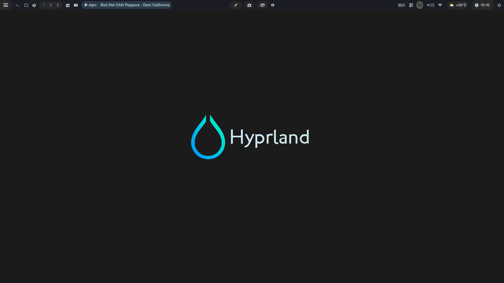
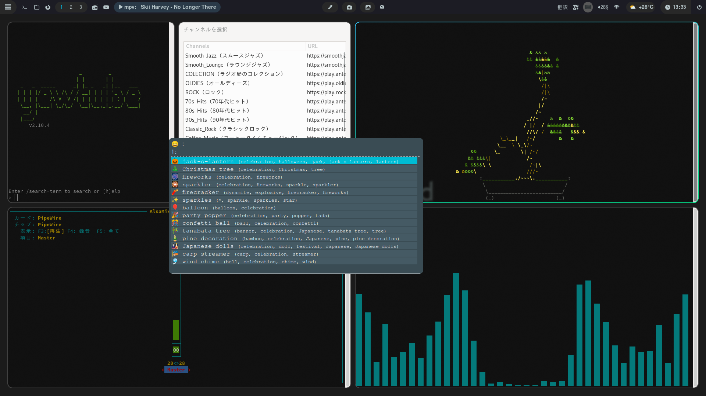
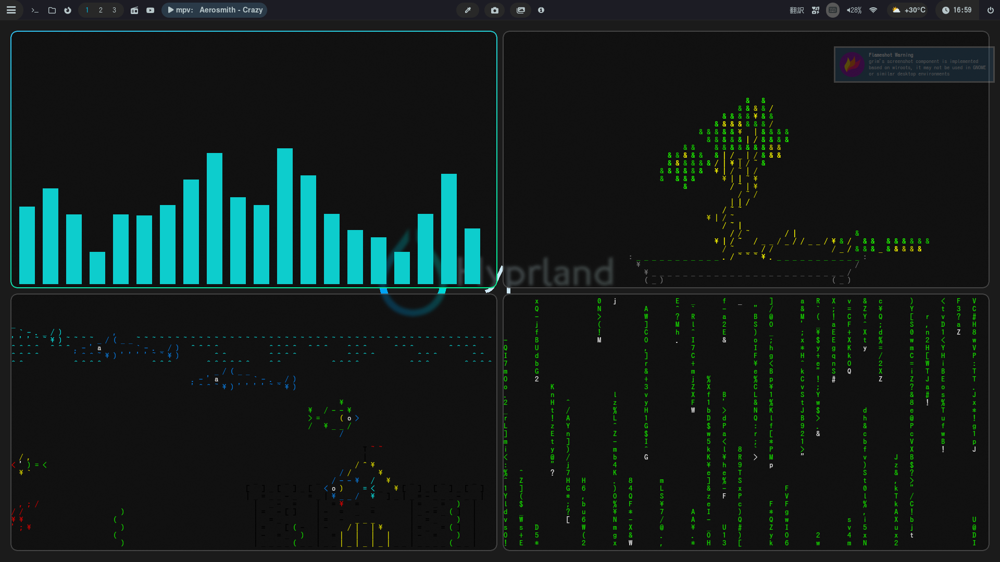

# my hyprland





### 次のコマンドでインストール
```curl https://raw.githubusercontent.com/yannsi/hyprland/main/test.sh | bash```

---


### pacman -Qqn

- adapta-gtk-theme
- alsa-utils
- asciiquarium
- cmatrix
- evince
- fcitx5-configtool
- fcitx5-gtk
- fcitx5-mozc
- fcitx5-qt
- firefox
- gedit
- git
- grim
- gum
- gvfs
- imagemagick
- lxappearance
- mpv
- mpv-mpris
- networkmanager
- noto-fonts-cjk
- noto-fonts-emoji
- otf-ipafont
- otf-aurulent-nerd
- papirus-icon-theme
- pcmanfm
- pipewire
- pipewire-alsa
- pipewire-jack
- pipewire-pulse
- python-pip
- python-pipx
- qrencode
- sddm
- rofi
- rofi-emoji
- rofimoji
- starship
- streamlink
- swaybg
- terminator
- ttf-font-awesome
- waybar
- wireplumber
- yt-dlp
- zenity


### pacman -Qem (AUR)

- cava
- cbonsai-git
- downgrade
- flameshot-git
- hyprpicker-git
- hyprshot
- otf-symbola
- ttf-symbola

- rofi-power-menu  （スクリプトを実行するだけでインストールはしない）


### pipx install
- yewtube
---


[waybar 使い方](.config/waybar/scripts/waybarsetumei.pdf)
